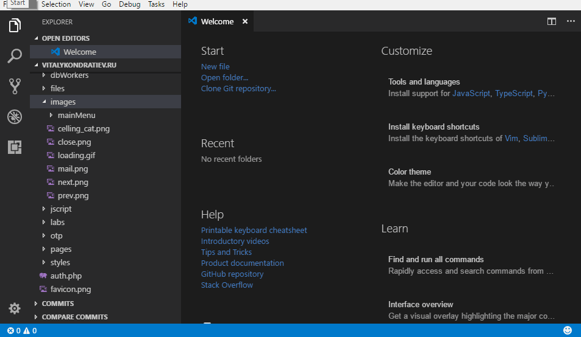
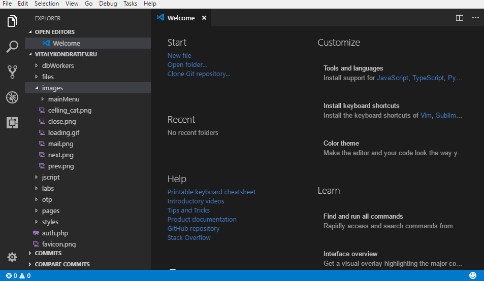
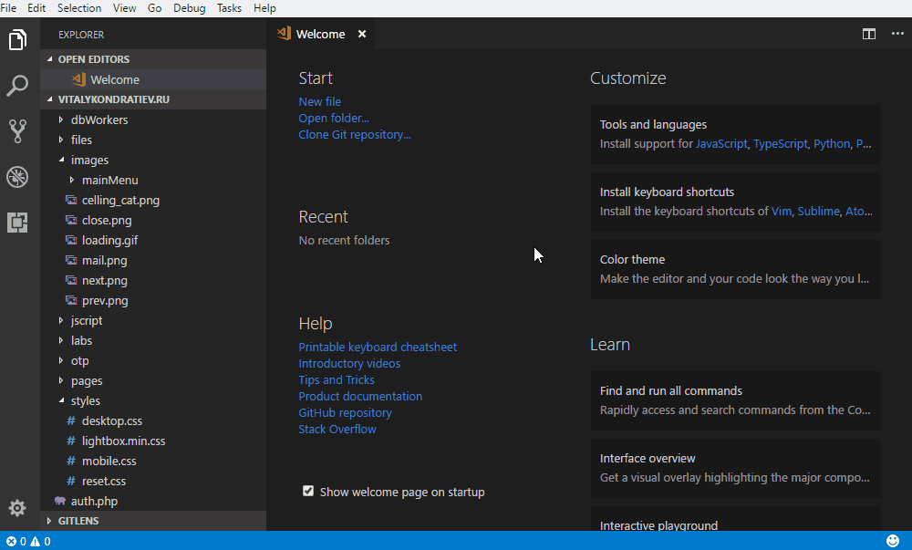
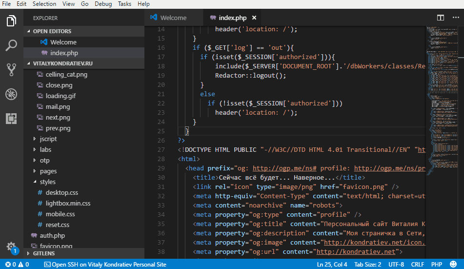

# About SSHExtension

[](https://gitter.im/Vitalykondratiev/vscode-sshextension?utm_source=badge&utm_medium=badge&utm_campaign=pr-badge&utm_content=badge)

[](https://marketplace.visualstudio.com/items?itemName=kondratiev.sshextension)
[](https://marketplace.visualstudio.com/items?itemName=kondratiev.sshextension)

This extension allows you to open an SSH connection in the integrated terminal.
The extension was created in order to have access to the SSH in conjunction with the already available access to the FTP.  

## Features

You can use configurations from another extensions (e.g. ftp-simple)  
The connection opens in a new instance of the integrated terminal.  
SSH port forwarding.

## How to use

### Open terminal from server list
- Open the Command Palette (usually `F1` or `Ctrl+Shift+P`).  
- Select the command `SSHExtension: Open SSH Connection`.  
- Select a server from the list.



### Fast open terminal
- Open workspace with project mapped to server
- Open any project file or go to already opened editor tab  
- Click on "Open SSH on \<servername>" button



### SSH port forwarding
- Open the Command Palette (usually `F1` or `Ctrl+Shift+P`).  
- Select the command `SSHExtension: SSH Port Forwarding`.  
- Select a forwarding type from: `Local to remote` (-L), `Local to remote` (-R), `SOCKS` (-D), `Recently used` (if exists saved arguments).  
- Enter the required parameters on request.  
- (Optionally) You can save your selections for faster port forwarding in the future.



To add a server, see Settings section.

## Requirements
  
You should still have an ssh agent, not necessarily that it is available in the entire system. it is important that it is accessible from the integrated VSCode terminal.

## Settings (for servers)

You can use ready-made config file from this extensions (if you use):
- ftp-simple ([see info about configuring](https://marketplace.visualstudio.com/items?itemName=humy2833.ftp-simple#user-content-config-setting-example), servers with `"type": "sftp"` only).

Or you can use extension settings simply add `sshextension.serverList` directive.

## Extension settings

#### sshextension.serverList

  * Type: `Array`
  * Defaut: `[]`

You can describe servers config in this parameter as array of objects.  
Server object parameters:  
- **name** _(string)_* - name of server (showing in picks list if `showHostsInPickLists` is `false`).  
- **host** _(string)_* - server hostname.
- **port** _(number)_ - SSH port. 
- **username** _(string)_* - username for authentication.
- **password** _(string)_ - password for authentication.
- **privateKey** _(string)_ - string that contains a path to private key.
- **project**  _(object)_ - specify local workspace path and server root path for fast terminal open.
- **path** _(string)_ - used for change directory after server connection.

For example:
```json
{
    "sshextension.serverList": [
        {
            "name": "Example server",
            "host": "example.com",
            "port": 22,
            "username": "user",
            "privateKey": "D:\\id_rsa",
            "project": {
                "D:/projects/project": "/home/user/project",
                "D:/projects/yet_another_project": "/home/user/yet_another_project"
            },
            "path": "/"
        },
        ...
    ]
}
```

#### sshextension.customCommands

  * Type: `Array`
  * Defaut: `[]`

Specifies custom commands which will execute on session start.  
For example:
```json
{
  "sshextension.customCommands": [
    "pwd",
    "ls"
  ]
}
```


#### sshextension.openProjectCatalog

  * Type: `Boolean`
  * Defaut: `false`

Open the project directory from the ftp-simple config, if it exists, after starting the SSH session.  
For example:
```json
{
  "sshextension.openProjectCatalog": true
}
```

#### sshextension.recentlyUsedForwardings

  * Type: `Array`
  * Defaut: `[]`

In this place stored all saved port forwarding args. You can save the arguments for port forwarding, which you often use.  
For example:
```json
{
  "sshextension.recentlyUsedForwardings": [
    "-R 9000:localhost:9000"
  ]
}
```

#### sshextension.allowMultipleConnections

  * Type: `Boolean`
  * Defaut: `false`

Allow you open few connections for one server at the same time.  
For example:
```json
{
  "sshextension.allowMultipleConnections": true
}
```

#### sshextension.showHostsInPickLists

  * Type: `Boolean`
  * Defaut: `false`

Show usernames and hosthames in pick lists instead on server names.  
For example:
```json
{
  "sshextension.showHostsInPickLists": true
}
```

## Roadmap

Add the ability to work with an external terminal.  
Open SSH connections in Putty.  
And a few more ~~secret (before their release)~~ features... ).

## Special thanks

[eduardbadillo](https://github.com/eduardbadillo)  
Added ability to use different port in ssh connections *([pull request](https://github.com/VitalyKondratiev/vscode-sshextension/pull/3) merged in version 0.1.2)*

## Feedback

I want to make a really useful extension, if you find a bug, please create an issue at github.  
If you have suggestions to the functional, then write to the same.  
And also if it's not difficult for you, leave a comment in the marketplace.